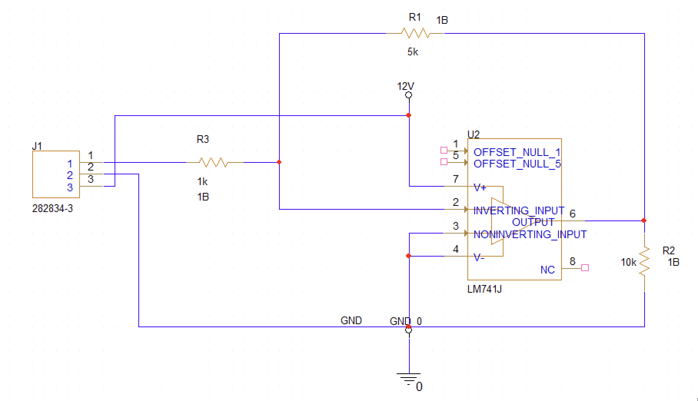
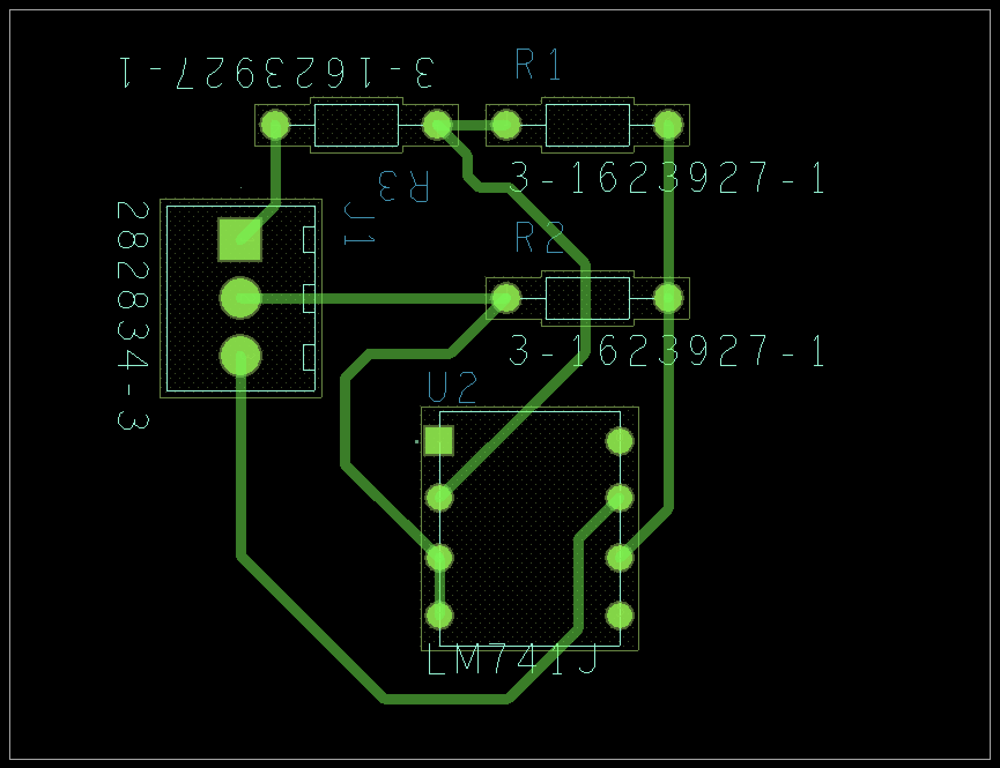

# OrCAD PCB Amplificador

Este repositorio contiene el diseño de un **amplificador operacional** realizado en **OrCAD/Cadence**, incluyendo tanto el esquemático como el PCB.

## 📌 Descripción del proyecto
El proyecto implementa un circuito con un amplificador operacional **LM741** en configuración no inversora.  
El diseño incluyó:
- Captura esquemática.
- Colocación de componentes.
- Ruteo de pistas en PCB.

## 🖼️ Imágenes del diseño

### Esquemático


### PCB Layout


## 🛠️ Herramientas utilizadas
- **OrCAD / Cadence PCB Designer**
- **PSpice** (para simulación)

## 📂 Archivos principales
- `AMP.dsn` → Archivo del esquemático.  
- `AMP.brd` → Archivo del diseño de PCB.  

## 🚀 Cómo abrir el proyecto
1. Clonar el repositorio:
   ```bash
   git clone https://github.com/javier434/OrCAD_PCB_Amplificador.git

